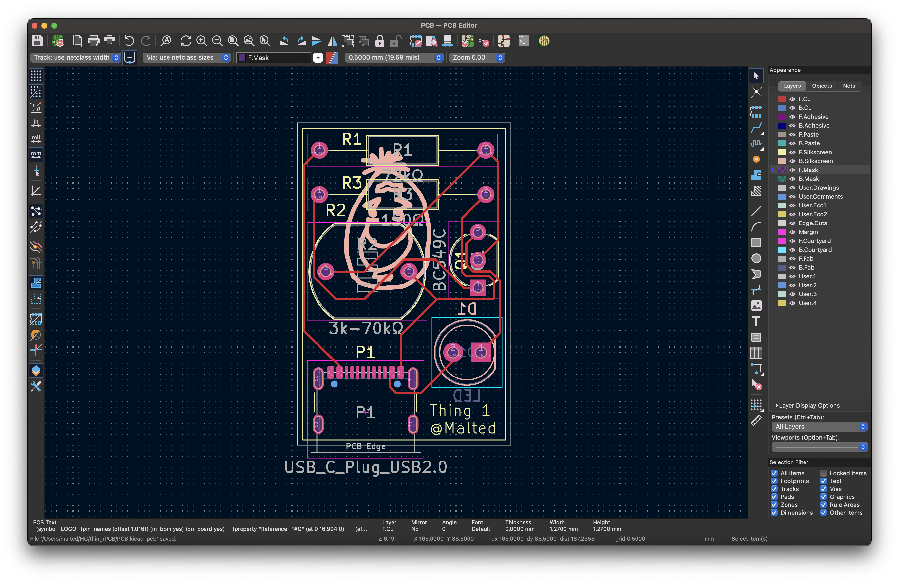
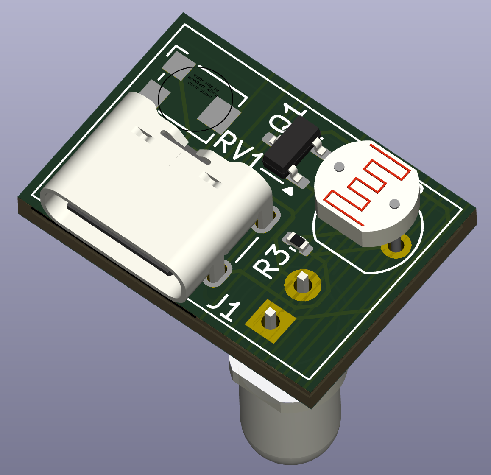
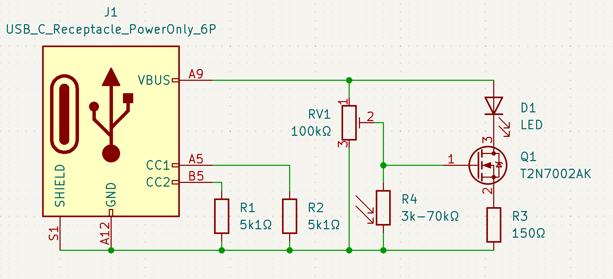

My subsystem is a nightlight that turns an LED on when an LDR (light-dependent resistor) detects it's dark. It's powered via a USB-C 5v rail.

When it's light, the resistance of the LDR is low, meaning the voltage at the base of the transistor is low, so the transistor is switched off, meaning the LED is not lit.
When it's dark, the resistance of the LDR is high, meaning the voltage at the base of the transistor is high, so the transistor switches on, allowing current to flow from the collector to emmitter, turning it on, allowing current to flow through the LED, through R3 to ground, lighting it up.

---

Alex sent me [this](https://cdn.sparkfun.com/datasheets/Sensors/LightImaging/SEN-09088.pdf) datasheet for the GL5528 LDR so that's what I'm going to work off - it's very generic. I'm also using a generic BJT NPM (Mouser has ~200k of [these](https://www.mouser.com/datasheet/2/308/BC550_D-1802078.pdf) in stock so that's what I'll go off, although none of the following is specific to this component.)

I don't know how much 100 lux or 1 lux is, but going by the diagram I'm going to assume that 100 lux is "bright" and 1 lux is "dark".
This means that when it's bright, the LDR will have a resistance of ~3kΩ, and when it's dark the LDR will have a resistance of 70kΩ.

When it's light, I want the LED to be off. This means the transistor must be off, meaning Vb must be < 0.7V.
So, using the voltage divider equation `Vout = R2 / (R1 + R2) * Vin`, and a voltage under 0.7V, say, 0.2V as our Vbe target, we calculate R1 to be 72kΩ, as shown below.

```
0.2 = 3k / (R1 + 3k) * 5
0.04 = 3k / (R1 + 3k)
0.04 * R1 + 120 = 3k
0.04 * R1 = 2.88k
R1 = 2.88k / 0.04
R1 = 72k
```

Great. Now, let's check to make sure that when it's dark, Vbe will be > 0.7V by plugging 72kΩ into R1 (keeping in mind R2 is now 70kΩ);

```
Vout = 70k / (72k + 70k) * 5
Vout ~= 2.5V
```

Yay! The output of our voltage divider is > 0.7V, so it's going to switch the transistor on, meaning the LED will light up.

Now let's calculate R3. Without it, we'd be dumping 5V across our poor little LED.

I've selected a [nice little amber LED to use](https://www.mouser.com/datasheet/2/678/av02-1532en_ds_hlmp-wl02_2014-08-20-1827901.pdf). Nora said amber makes for a good nightlight colour. The datasheet says it has a 2.02V drop. BJTs typically drop 0.2V. So, the voltage our R3 needs to drop is (5 - (2.02 + 0.2)) = 2.78V`.

Our LED datasheet says the LED should typically be operated between 10mA and 30mA, so let's pick 20mA. This means R3 needs to be the following;

```
V = IR
2.78 = 0.02 * R
R = 2.78 / 0.02
R = 139
```

R3 needs to be 139Ω. There's no 139Ω resistor in the [E24 series](https://asenergi.com/pdf/resistors/standard-resistor-values-e24.pdf) so I'll pick a 150Ω resistor which is close enough!

---

> It's been so long since I've done calculations like this that I forgot to make sure Ic is high enough to saturate the transistor. It's *JUST* about there. It's not going to kneecap the subsystem as far as I can tell so I won't rejig the voltage divider. I should have worked backwards from my load, then calculate my minimum base current, then designed the voltage divider. You live and you learn, eh?

P.S. I'm pretty proud I got my pcb traced in a single layer! Routing everything again and again was very theraputic.




