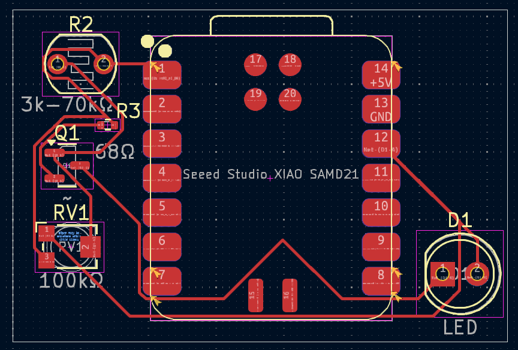
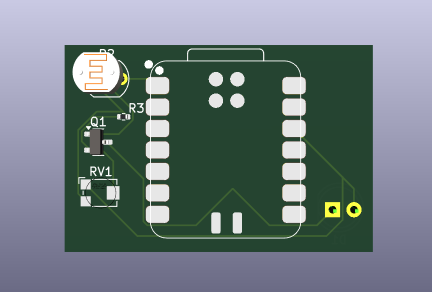
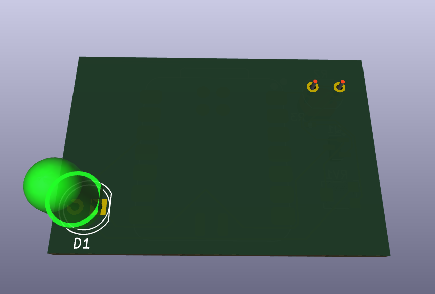
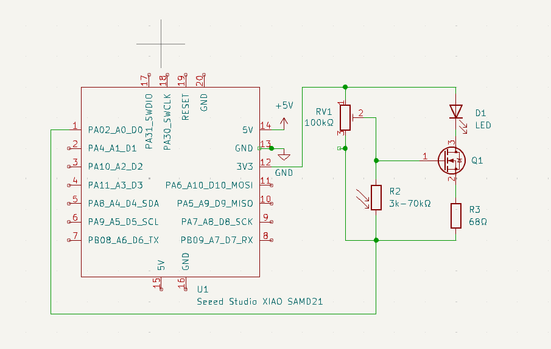

# Xiao RP2040 Seeed Microcontroller 
## Plan
In the current build the USB-C output is diluted to 5V to work with the electronics.
The Seeed XIAO only supports 3.3V output through its I/O pins but if I modify the resistor amounts then I should be able to get it to work with the current system.
If down the queue someone adds in a feature that needs more then this, they can upgrade the power themselves.

## Physical Version
I setup a physical version on Saturday Night with an Raspberry Pi Zero 2W as it has the exact same I/O output, chip, etc... as the Seeed Xiao. I had some problems with getting the software to work and then I found out it automatically sets the GPIO output to High and setting it to Low made it turn off.

## Schematic / PCB
On Sunday night I setup the Schematic and PCB I just had a lot of errors with it beachballing everytime I did a single trace which was very frustrating and made it take about an hour to do a 5-10 minute trace.

## Photos

